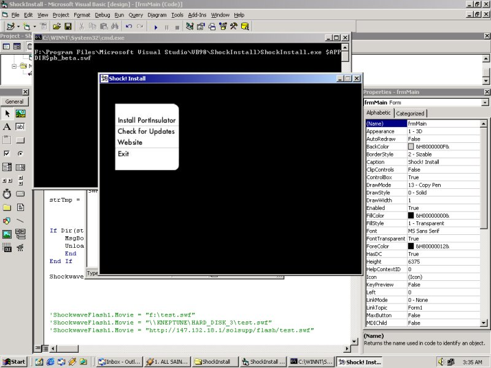



## ShockInstall

### Description

Create Flash movies and allow them to launch ANY associated file on your system.

Ideal for use as a CD menu and the like.

(Excuse the name, I always call Flash, Shock because I use ShockMachine a lot :-0 )
 
### More Info
 
An absolute filename to the source Flash movie is required, however to allow use on a CD, to following command should be used

ShockInstall.exe $APPDIR$[flashfilename]

To be able to use this to its fullest, you must be able to create Flash movies.

             |
---                |---
**Submitted On**   |2000-07-02 21:33:14
**By**             |[Neil Ramsbottom](https://github.com/Planet-Source-Code/PSCIndex/blob/master/ByAuthor/neil-ramsbottom.md)
**Level**          |Intermediate
**User Rating**    |4.0 (8 globes from 2 users)
**Compatibility**  |VB 5\.0, VB 6\.0
**Category**       |[Miscellaneous](https://github.com/Planet-Source-Code/PSCIndex/blob/master/ByCategory/miscellaneous__1-1.md)
**World**          |[Visual Basic](https://github.com/Planet-Source-Code/PSCIndex/blob/master/ByWorld/visual-basic.md)
**Archive File**   |[CODE\_UPLOAD79837202000\.zip](https://github.com/Planet-Source-Code/neil-ramsbottom-shockinstall__1-9930/archive/master.zip)

